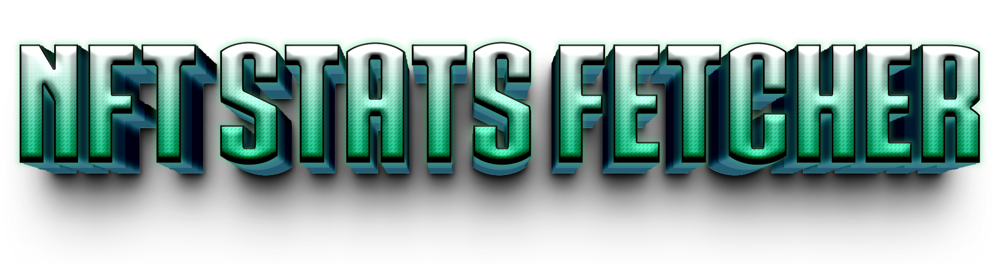

# 📊 NFT Stats Fetcher

This is a **Netlify-hosted serverless tool** that allows you to:

* ✅ Fetch **live NFT stats** (total supply, owners, floor price) from multiple providers
* ✅ Support **multiple collections** on Ethereum or other EVM chains
* ✅ Use **manual total supply overrides** when APIs don’t return supply data
* ✅ Embed stats anywhere — including **WordPress Beaver Builder HTML blocks**
* ✅ Create **full stats dashboards** or **small collection cards** with ease

---

## 🔒 Your Data Safety Matters

This fetcher **does not require wallet connections**, keys, or logins.
All lookups are done using **public blockchain and marketplace APIs**.
Your assets remain **completely safe**, and usage is **anonymous**.

---

## 🚀 Features

| Feature             | Description                                                         |
| ------------------- | ------------------------------------------------------------------- |
| 📦 Multi-Collection | Track stats for any number of NFT collections                       |
| 🛡 API Fallbacks    | Uses Moralis, OpenSea, and Alchemy in order of availability         |
| 📝 Supply Overrides | Manually set total supply for collections missing supply data       |
| 🎨 Easy Embeds      | Drop into any HTML block (perfect for Beaver Builder or WP widgets) |
| 💻 Dashboard Ready  | Build full pages showing multiple collections at once               |
| 🌍 CORS Friendly    | Works on any site or CMS                                            |

---

## 📊 Live Example

[](https://YOUR_NETLIFY_SITE.netlify.app/)

---

## 📦 Files Included

* `netlify.toml` – Netlify build & function settings
* `netlify/functions/opensea.js` – Main serverless function fetching stats
* `pm-fetch.js` – Front-end helper to call the function & render results  (**For WordPress users, store this file in** `/wp-content/themes/bb-theme/js`)
* `pandamania-blocks.css` – Minimal CSS styling for cards or dashboards  (**For WordPress users, store this file in** `/wp-content/themes/bb-theme/css`)

---

## 🛠️ Powered By

* [Moralis NFT API](https://moralis.io/)
* [OpenSea API](https://docs.opensea.io/)
* [Alchemy API](https://www.alchemy.com/)

---

## 🚀 Deployment

### 1️⃣ Clone this repo

```bash
git clone https://github.com/<YOUR_USER>/NFT-Stats-Fetcher.git
cd NFT-Stats-Fetcher
```

### 2️⃣ Set Netlify Environment Variables

| Variable                | Required | Description                                |
| ----------------------- | -------- | ------------------------------------------ |
| MORALIS\_API\_KEY       | ✅        | Your Moralis API key                       |
| OPENSEA\_API\_KEY       | ✅        | Your OpenSea API key                       |
| ALCHEMY\_API\_KEY       | Optional | Fallback for supply queries                |
| SUPPLY\_OVERRIDES\_JSON | Optional | JSON mapping `{ "contract": totalSupply }` |

Example for **SUPPLY\_OVERRIDES\_JSON**:

```json
{
  "0x29be0951309805ddcfa90592c3bf765925871344": 921,
  "0x870b1fa5d36696af7b3cfa0e2721872efd790b51": 378,
  "0xc0613cde37d2eceddc496f3d85cec12ffa2bdd00": 144,
  "0xb3ed773a2b61b53a7a8da02eb0555b4126b874ff": 2510,
  "0x5c39cde98ebd0195cc6ccd81ab8be82948da28af": 5010,
  "0xde07b22e52f2144bf52f5c4c4275ed1f8dd72b49": 5004
}
```

### 3️⃣ Deploy to Netlify

Push to GitHub and connect to Netlify — build and deploy will be automatic.

---

## 📜 Usage Example — Single Collection Card

```html
<link rel="stylesheet" href="https://YOUR_NETLIFY_SITE.netlify.app/pandamania-blocks.css">
<script src="https://YOUR_NETLIFY_SITE.netlify.app/pm-fetch.js"></script>

<div id="pandamania-card" class="pm-card">
  <div class="pm-name">PandaMania NFT Collection</div>
  <div class="pm-line">Loading…</div>
</div>

<script>
pmFetchStats(
  "pandamania-card",
  "pandamanianftcollection",
  "0x29be0951309805ddcfa90592c3bf765925871344"
);
</script>
```

---

## 📜 Usage Example — Full Stats Page

```html
<div id="nft-stats-root"></div>

<script src="https://YOUR_NETLIFY_SITE.netlify.app/pm-fetch.js"></script>
<script>
const collections = [
  { name: "PandaMania", slug: "pandamanianftcollection", addr: "0x29be0951309805ddcfa90592c3bf765925871344", chain: "eth" },
  { name: "Red Panda Pals", slug: "redpandapals", addr: "0x870b1fa5d36696af7b3cfa0e2721872efd790b51", chain: "eth" },
  { name: "Bamboo Buddies", slug: "bamboobuddies", addr: "0xc0613cde37d2eceddc496f3d85cec12ffa2bdd00", chain: "eth" },
  { name: "Panda Cubs", slug: "panda-cubs", addr: "0xb3ed773a2b61b53a7a8da02eb0555b4126b874ff", chain: "eth" },
  { name: "Red Panda Cubs", slug: "red-panda-cubs", addr: "0x5c39cde98ebd0195cc6ccd81ab8be82948da28af", chain: "eth" },
  { name: "Bamboo Shoots", slug: "bamboo-shoots-1", addr: "0xde07b22e52f2144bf52f5c4c4275ed1f8dd72b49", chain: "eth" }
];

const root = document.getElementById("nft-stats-root");
collections.forEach(c => {
  const div = document.createElement("div");
  div.id = `card-${c.addr}`;
  div.className = "pm-card";
  div.innerHTML = `<div class="pm-name">${c.name}</div><div class="pm-line">Loading…</div>`;
  root.appendChild(div);
  pmFetchStats(div.id, c.slug, c.addr, c.chain);
});
</script>
```

---

## ⚡ Performance Tips

* ⏱ Rate-limit refreshes — For example, refresh once every 12–24 hours for stable collections.
* 📦 Use caching — Serve fetched data from `localStorage`, Netlify build cache, or your own API instead of live calls on every page load.
* 🎯 Limit collections — Only load stats for collections relevant to the page.
* 🛑 Disable debug mode (`debug=1`) in production — Debug requests add extra API calls.
* 📝 Use `SUPPLY_OVERRIDES_JSON` — Avoids extra RPC calls for missing total supply.

---

## 🔄 Switch to Alchemy-Only Mode

If you want to avoid Moralis entirely (to prevent CU overages), you can:

1. Remove or comment out any Moralis calls in `opensea.js`.
2. Set `ALCHEMY_API_KEY` in Netlify environment variables.
3. Change the fetch logic to use **Alchemy’s NFT API** and metadata endpoints for supply and ownership data.
4. Keep OpenSea as a fallback only for floor price.

This reduces Moralis CU usage to zero and shifts the load to Alchemy (which has a generous free tier).

---

## ❤️ Built By

Made by **@atomnft.eth**
Panda love and blockchain vibes 🐼💖

---

## 📥 Contributions

Feel free to fork, customize, and use it in your own NFT projects. Pull requests welcome!
